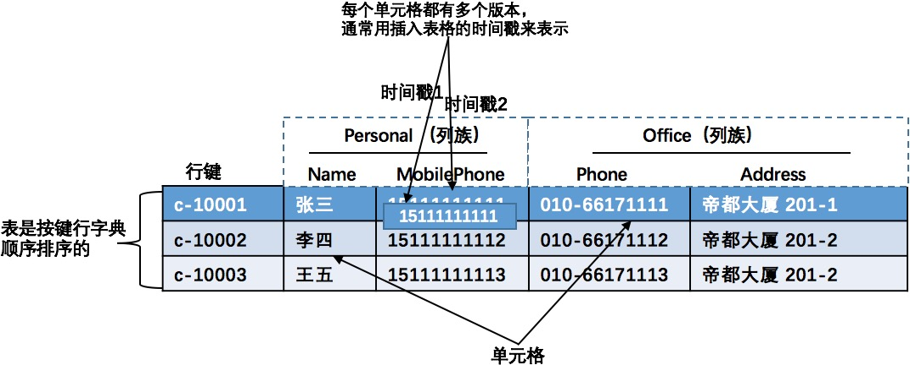

#### HBase 介绍
**HBase的数据的存储结构不同于传统的关系型数据库，HBase是一种结构松散，分布式，多维度有序映射的持久化存储系统，它索引的依据是行键、列键和时间戳。
HBase可以被看作键值存储数据库、面向列族的数据库** 
[原文地址请点击](http://0b4af6cdc2f0c5998459-c0245c5c937c5dedcca3f1764ecc9b2f.r43.cf2.rackcdn.com/9353-login1210_khurana.pdf)
##### HBase 数据存储模型基础
**HBase数据存储结构中主要包括：表、行、列族、列限定符、单元格和时间戳，下面将对HBase的数据存储模型的概念一一解释：** 
**表：** `表`的作用将存储在HBase的数据组织起来。 
**行：** `行`包含在`表`中，数据以`行`的形式存储在HBase的表中。HBase的表中的每一`行`数据都会被一个唯一标识的`行键`标识。`行键`没有数据类型，在HBase存储系统中`行键`总是被看作一个byte数组。 
**列族：** 在`行`中的数据都是根据`列族`分组，由于`列族`会影响存储在HBase中的数据的物理布置，所以`列族`会在使用前定义（在定义`表`的时候就定义`列族`），并且不易被修改。
在HBase的存储系统中数据存储在相同的`表`中的所有`行`的数据都会有相同的`列族`（这和关系型数据库的表一样，每一行数据都有相同的列）。 
**列限定符：** 存储在在列族中的数据通过`列限定符`或`列`来寻址的，`列`不需要提前定义（不需要在定义`表`和`列族`的时候就定义`列`），列与列之间也不需要保持一致。`列`和`行键`一样没有数据类型，并且在HBase存储系统中`列`也总是被看作一个byte数组。 
**单元格：** 根据`行键`、`列族`和`列`可以映射到一个对应的`单元格`，`单元格`是HBase存储数据的具体地址。在`单元格`中存储具体数据都是以Byte数组的形式存储的，也没有具体的数据类型。 
**时间戳：** `时间戳`是给定`值`的一个版本号标识，每一个`值`都会对应一个`时间戳`，`时间戳`是和每一个值同时写入HBase存储系统中的。在默认情况下，时间戳表示数据服务在写入数据时的时间，但可以在将数据放入单元格时指定不同的`时间戳`值。 

##### HBase 数据模型理解
HBase中存储的数据，`表`组织结构如下图所示：

---
上图为HBase中的一个表，由两个`列族`（Personal和Office）组成，每个`列族`都有两列。 包含数据的实体称为`单元格`,`行`根据行键进行排序。
为了更好的理解HBase中的多维数据存储模型，这里从上图的表中摘出一条数据，将它在HBase的表中的存储转化成如下图所表示的形式去理解他。

---
如果将HBase表中的数据理解成键值对存储的形式,那么也可以用如下图的形式来理解存储在HBase表中的数据。

##### Hbase表设计要点
1. `行键`是HBase表结构设计中最重要的一件事情，`行键`决定了应用程序如何与HBase表进行交互。如果没设计好`行键`还会影响从HBase中读出数据的性能。 
2. HBase的表结构很灵活，而且不关心数据类型，你可以以byte数组的形式存储任何数据。 
3. 存储在相同的列族中的数据具有相同的特性（易于理解）。 
4. HBase主要是通过`行键`来建立索引。 
6. HBase不支持多行事务，所有尽量在一次API请求操作中获取到结果。 
7. HBase中的`键`可以通过提取其hash值来保证`键`长度是固定的和均匀分布，但是这样做会牺牲`键`的数据排序和可读性。 
9. `列限定符`和`列族`名字的长度都会影响I/O的读写性能和发送给客户端的数据量，所以给它们命名的时候应该简洁！ 